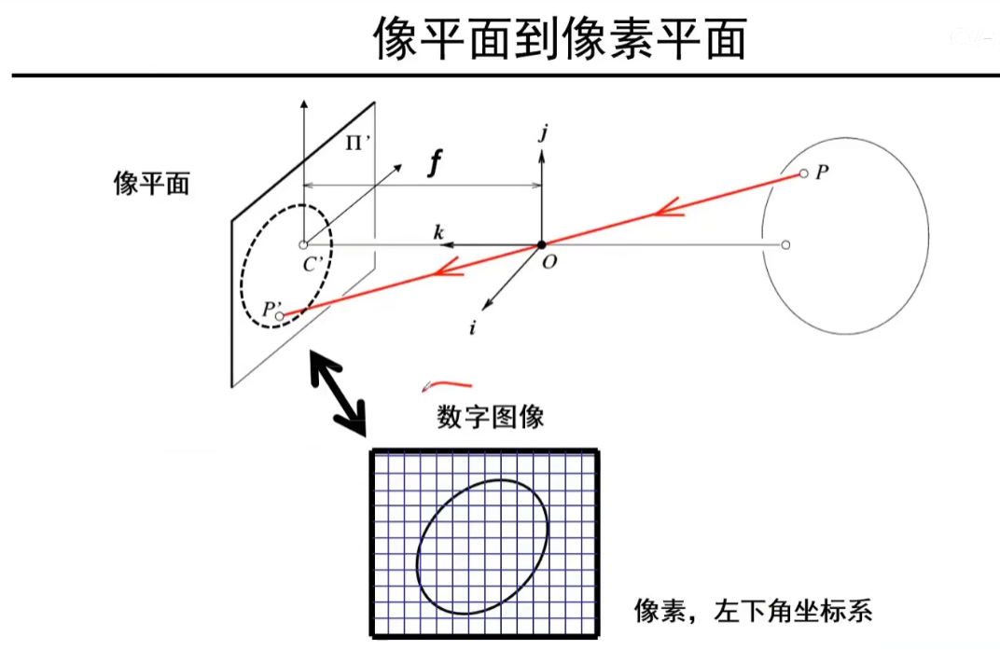
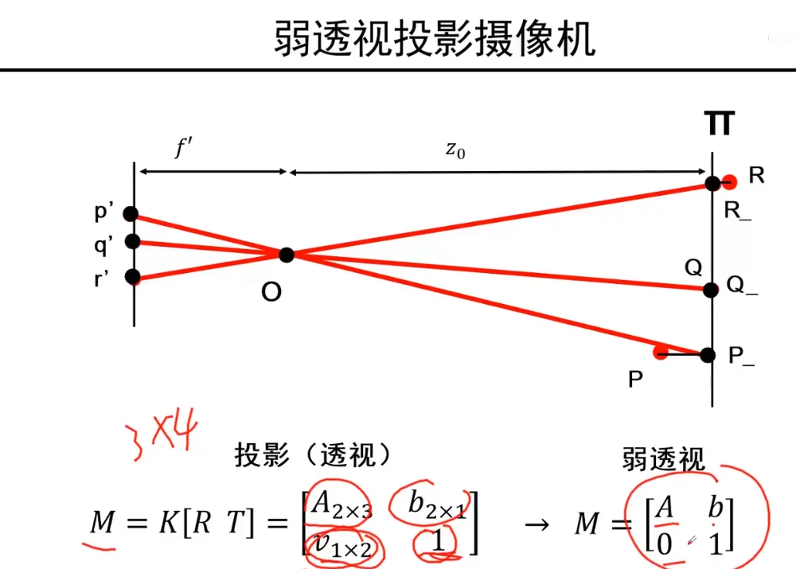

# 三维重建 - 北京邮电大学_鲁鹏

## 1. 摄像机模型

三维世界是怎么通过摄像机映射成二维的

小孔成像的二义性

光圈太大了，言外之意就是孔太大了的话，胶片上同一个点可能会接受真实物体表面好几个位置的点的信息，成像效果就会模糊，但亮度会增加

缩小光圈能变得更加清楚，但是代价就是进来的光线越来越少，成像亮度越来越暗。那么真实的相机既想成像效果清晰，也要成像亮度增加应该怎么办呢？ --> 增加透镜！

像素坐标系在工业上一般都是左上角为原点，其中k和l是 米 与 像素之间进行单位转换的一个度量，右侧括号内加的$c_x,  c_y$表示从理论推导（成像平面的中心位置）迁移到现实工业推广应用时候（以左上角为原点）时候校正的偏移，因此要加上$c_x, c_y$

三维点 (摄像机坐标系下) $P$ 到二维点（像素平面下） $P_{}'$ 不是线性变换

二维：欧式空间(E)， 三维：齐次空间(H)

对于一个二维坐标下的图像点，加一维增广为3维。那么一个三维空间的点如何变为二维呢？要将第三维除掉，就得到了其在二维空间中对应的点

由于制造工艺的问题造成的摄像机偏斜

在摄像机的内参数矩阵中，共有 $\alpha, \beta, \theta, c_x, c_y$这五个自由变量

规范化摄像机特点：其世界坐标系下的点的三维坐标就是图像点的一个坐标

引入世界坐标系使得分析问题变得相对简单，但这样的模型只能描述三维世界中摄像机坐标系的点到像素的映射，不能描述像素到摄像机坐标系的映射。因此需要对模型进行进一步的拓展

三维世界内的旋转和平移是可以通过矩阵变换来实现的，旋转会有一个旋转矩阵，平移会有一个平移矩阵。世界坐标系下的一个点可以通过旋转和平移转到摄像机坐标系下的一个点。上式中 $R$为三行三列的矩阵(表示旋转)， $T$为三行一列的列向量(表示平移)，他们共同拼成了一个四行四列的矩阵

上图展示了**摄像机的投影模型**，从三维世界坐标系（\(\mathbf{O_w}, \mathbf{i_w}, \mathbf{j_w}, \mathbf{k_w}\)）到二维图像平面的转换过程。它涉及了摄像机标定中的几个核心概念，包括**内参矩阵**、**外参矩阵**和**投影矩阵**，并通过这些矩阵将三维点转换为二维图像点。

1. **世界坐标系与相机坐标系**：
   - 图中有两个坐标系：世界坐标系（\(\mathbf{O_w}, \mathbf{i_w}, \mathbf{j_w}, \mathbf{k_w}\)）和摄像机坐标系（\(\mathbf{O}, \mathbf{i}, \mathbf{j}, \mathbf{k}\)）。
   - 世界坐标系中的点 \(\mathbf{P_w}\) 是我们需要投影到图像平面上的三维点。
   - 摄像机坐标系中，\(\mathbf{O}\) 是摄像机的光心，\(\mathbf{C'}\) 是图像平面上的投影中心，\(\mathbf{f}\) 是焦距，\(\mathbf{P'}\) 是投影到图像平面上的点。

2. **内参矩阵 \(K\)**：
   - 内参矩阵 \(K\) 包含了摄像机的内部参数，如焦距（\(\alpha\)、\(\beta\)）、主点偏移（\((c_x, c_y)\)），以及可能的像素缩放因子。
   - \(K\) 用于将摄像机坐标系中的点转换为图像坐标系中的点。
   - 内参矩阵的表达式如下：
     \[
     K = \begin{bmatrix}
     \alpha & -\alpha \cos \theta & c_x \\
     0 & \beta & c_y \\
     0 & \sin \theta & 0
     \end{bmatrix}
     \]
     其中，\(\alpha\)、\(\beta\) 与摄像机的焦距和像素缩放有关，\(\theta\) 是像素的倾斜角。

3. **外参矩阵 \(R, T\)**：
   - 外参矩阵用于描述摄像机相对于世界坐标系的姿态。它由旋转矩阵 \(R\) 和平移矩阵 \(T\) 组成。
   - 旋转矩阵 \(R\) 表示从世界坐标系到摄像机坐标系的旋转，平移矩阵 \(T\) 表示世界坐标系原点 \(\mathbf{O_w}\) 到摄像机坐标系原点 \(\mathbf{O}\) 的位移。

4. **完整的投影模型**：
   - 投影的过程可以表示为：
     \[
     \mathbf{P'} = K \begin{bmatrix} I & 0 \end{bmatrix} \mathbf{P}
     \]
     其中 \(\mathbf{P}\) 是摄像机坐标系下的三维点。
   - 而摄像机坐标系中的三维点可以通过外参矩阵将世界坐标系中的点 \(\mathbf{P_w}\) 转换而来：
     \[
     \mathbf{P} = \begin{bmatrix} R & T \\ 0 & 1 \end{bmatrix} \mathbf{P_w}
     \]
     最终，投影模型可以表示为：
     \[
     \mathbf{P'} = K \begin{bmatrix} R & T \end{bmatrix} \mathbf{P_w} = M \mathbf{P_w}
     \]
     其中，\(M\) 是完整的投影矩阵。

5. **图中的关键变量解释**：
   - \(\mathbf{P_w}\)：世界坐标系中的三维点，位于世界坐标系（\(\mathbf{O_w}\)）中。这个点通过外参矩阵和内参矩阵的作用，最终投影到摄像机的图像平面上。
   - \(\mathbf{P}\)：摄像机坐标系中的三维点，是通过外参矩阵将世界坐标系中的点 \(\mathbf{P_w}\) 转换得到的。
   - \(\mathbf{P'}\)：图像平面上的二维投影点，是通过内参矩阵 \(K\) 作用于摄像机坐标系中的三维点 \(\mathbf{P}\) 得到的。

这张图展示了从三维世界坐标系到二维图像平面投影的过程。通过内参矩阵和外参矩阵，三维点 \(\mathbf{P_w}\) 最终投影为图像平面上的点 \(\mathbf{P'}\)。图中重点强调了摄像机的投影模型，这个模型在计算机视觉中非常重要，用于许多应用场景，如三维重建、图像校正、目标检测等。

上图中从左到右依次为：像素坐标系、摄像机坐标系和世界坐标系

## 2. 其他摄像机模型

弱透视投影的用处：三维点到二维点的映射直接有放大率这个参数来决定，减少了参数，简化了计算过程，当目标距离比较远的时候，基本上可以将其假设为平面

## 3. 总结

- 针孔模型 & 透镜： 小孔成像和加镜头的一些性质，缺陷（引入了景深和畸变）
- 摄像机几何： 世界坐标系下的三维点映射到了二维像素平面，齐次（三维）到欧式（二维）的映射是一对一，但是欧式（二维）到齐次（三维）的映射不是一对一
- 其他摄像机模型： 规范化摄像机、弱透视投影、正交投影

## 4. 补充知识

因为本身 $Ax$ 的值就是0，因此在优化 $E(x)$ 时，如果 $x$ 是解的话，那么 $\lambda x (\lambda \neq 0)$ 都是该方程组的解，因此对 $x$ 加入了惩罚项 $\| x \| = 1$的约束

