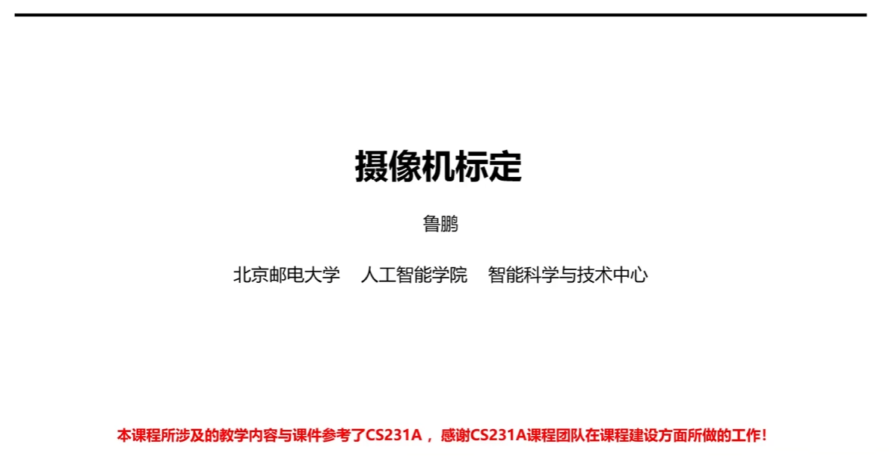
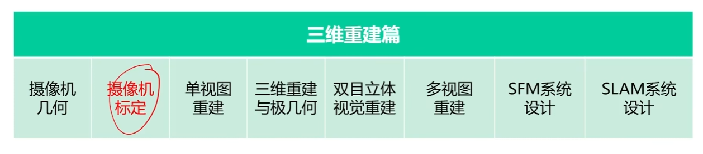
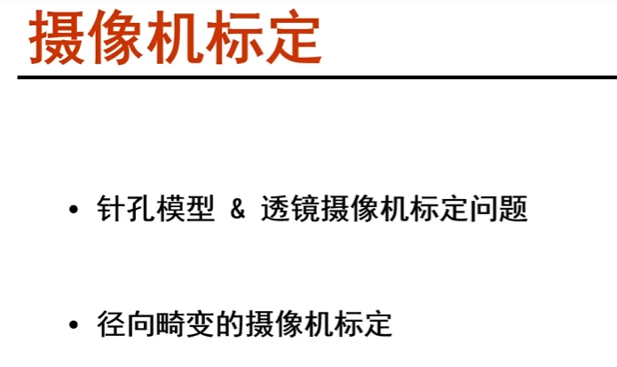
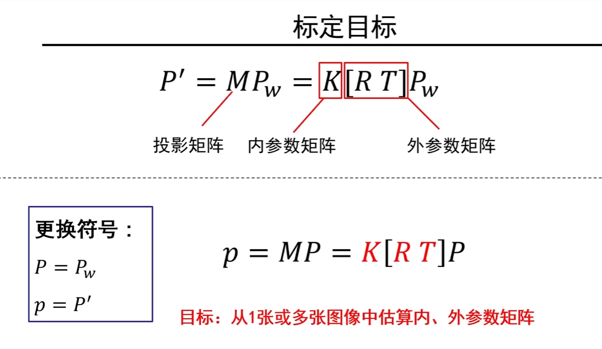
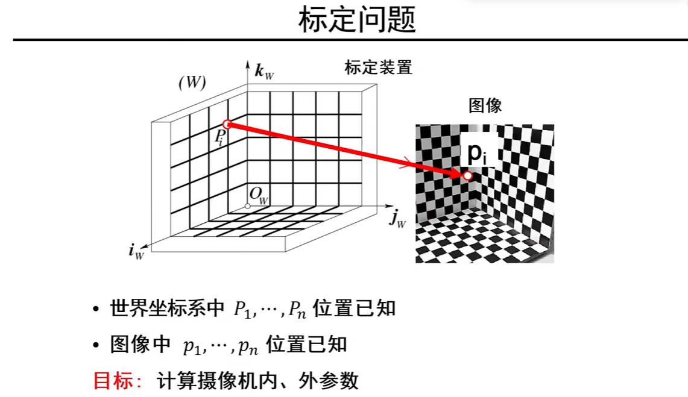
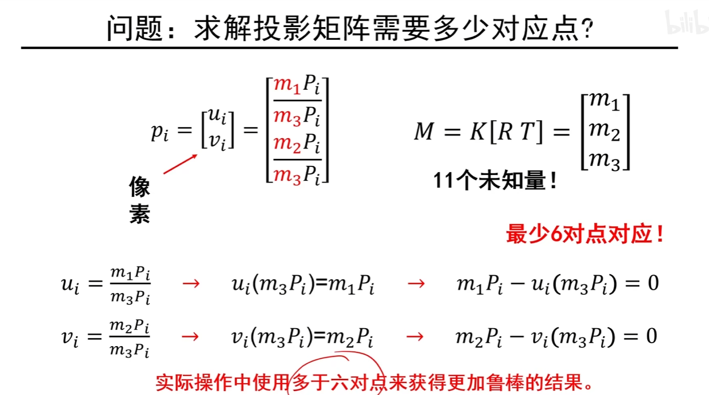
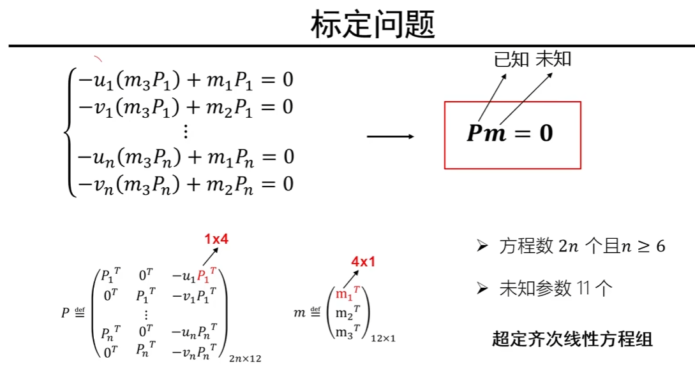

# 摄像机标定

当拿到一个摄像机的时候，不可能问厂家说这个摄像机的内参是多少，我们通常希望一些对应关系来求解出摄像机的内、外部参数。通过一些拍照和照片之间的三维物体之间的关系自动求解摄像机之间的内、外部参数。因此标定就是求解摄像机的内外参数矩阵。

摄像机的内外参数决定了三维点和二维点的映射关系，如果知道的摄像机的内外参数，那么从二维点映射到三维点这个空间，来求解三维问题就有可能。因此只有知道了摄像机的内外参数矩阵，才能知道二维和三维的对应关系，也才能把二维有可能转化成三维。

实际操作中使用多于六对点来获得更加鲁棒的结果，这样即使有些点有偏差，对最终的性能也没有太大影响

