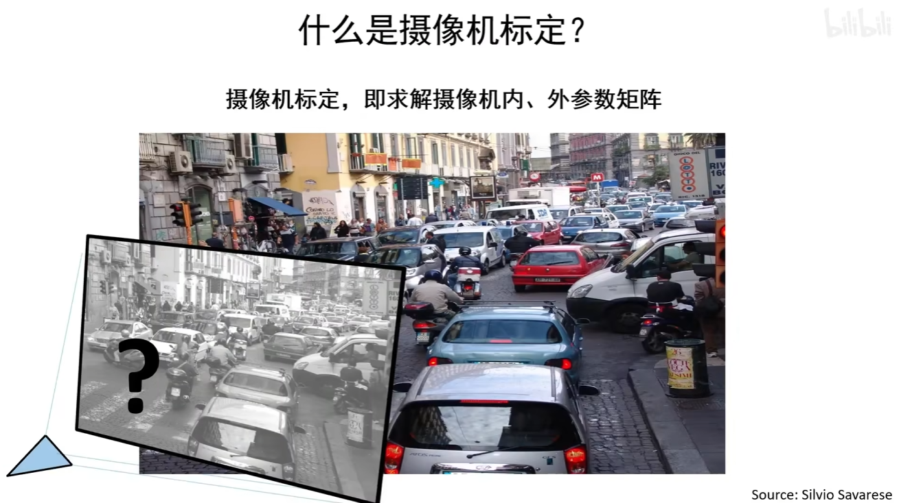
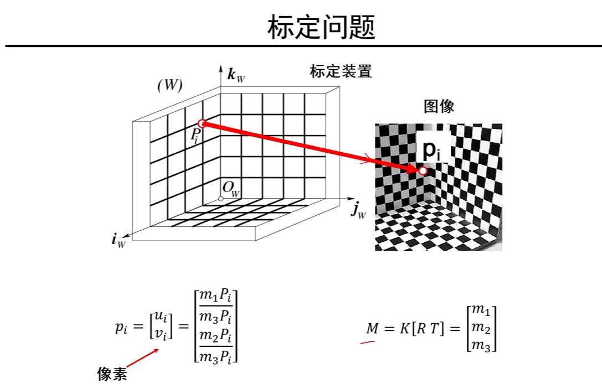
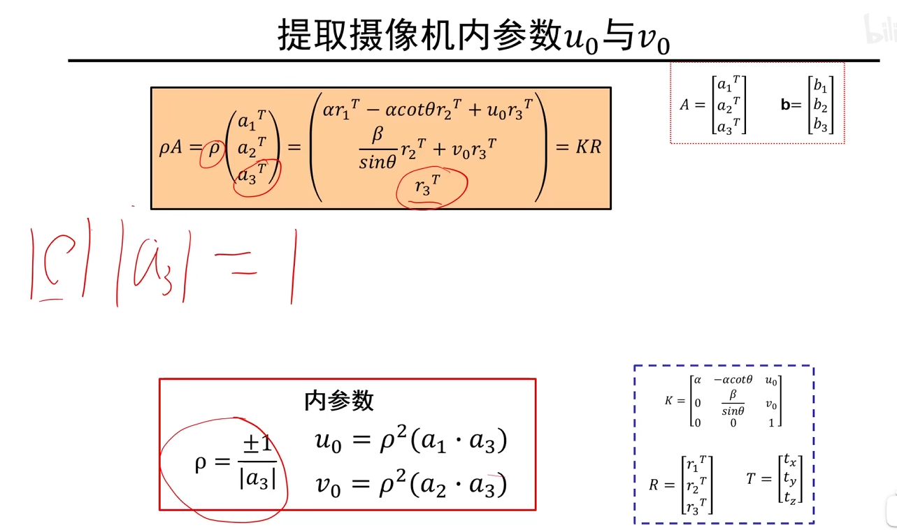

# 摄像机标定

当拿到一个摄像机的时候，不可能问厂家说这个摄像机的内参是多少，我们通常希望一些对应关系来求解出摄像机的内、外部参数。通过一些拍照和照片之间的三维物体之间的关系自动求解摄像机之间的内、外部参数。因此标定就是求解摄像机的内外参数矩阵。

摄像机的内外参数决定了三维点和二维点的映射关系，如果知道的摄像机的内外参数，那么从二维点映射到三维点这个空间，来求解三维问题就有可能。因此只有知道了摄像机的内外参数矩阵，才能知道二维和三维的对应关系，也才能把二维有可能转化成三维。

这张图展示了三维重建中常见的**摄像机标定**（Camera Calibration）问题。

### 图示概述
图左侧为世界坐标系 \((W)\)，右侧为图像平面。通过摄像机标定，我们可以从三维空间中的点 \(\mathbf{P}_i\) 映射到图像平面中的像素点 \(\mathbf{p}_i\)。

#### 1. 世界坐标系 \(\mathbf{P}_i\)
图左侧显示的是三维空间中的某个点 \(\mathbf{P}_i\)，该点表示在世界坐标系下的一个物体点，其坐标记为 \(\mathbf{P}_i = [X_w, Y_w, Z_w, 1]^T\)，这是一个 **4维向量**，表示为**齐次坐标**形式。这个点通过摄像机映射后，投影到图像平面上的像素点 \(\mathbf{p}_i\)。

#### 2. 投影矩阵 \(M\)
图中间部分的矩阵 \(M = K [R \mid T]\) 是投影矩阵，用于描述从三维世界坐标系到二维图像坐标系的转换关系：
- **\(K\)** 是相机的**内参矩阵**，它包含了相机的焦距、主点坐标等参数。它是一个 \(3 \times 3\) 矩阵。
- **\([R \mid T]\)** 是**外参矩阵**，表示从世界坐标系到摄像机坐标系的旋转矩阵 \(R\) 和平移矩阵 \(T\)。\(R\) 是一个 \(3 \times 3\) 的旋转矩阵，\(T\) 是一个 \(3 \times 1\) 的平移向量。
  
因此，整个投影矩阵 \(M\) 是一个 \(3 \times 4\) 的矩阵，负责将齐次坐标系中的三维点转换为二维图像平面上的点。

#### 3. 图像坐标系 \(\mathbf{p}_i\)
图右侧为图像平面，表示三维点 \(\mathbf{P}_i\) 在相机中成像后的二维像素点 \(\mathbf{p}_i = [u_i, v_i]^T\)，这是图像上的像素坐标。
投影关系可以表示为：
\[
\mathbf{p}_i = \begin{bmatrix} u_i \\ v_i \end{bmatrix} = \begin{bmatrix} \frac{m_1 \mathbf{P}_i}{m_3 \mathbf{P}_i} \\ \frac{m_2 \mathbf{P}_i}{m_3 \mathbf{P}_i} \end{bmatrix}
\]
其中 \(m_1, m_2, m_3\) 是投影矩阵的行向量。即，通过 \(M\) 对三维点 \(\mathbf{P}_i\) 进行变换，然后除以 \(m_3 \mathbf{P}_i\) 的结果，得到图像平面上的像素坐标 \((u_i, v_i)\)。

这张图的核心是描述从三维空间中一个点如何通过投影矩阵 \(M = K[R \mid T]\) 映射到二维图像平面上的像素点的过程。该过程体现了相机的标定原理，标定就是要确定出内参矩阵 \(K\) 和外参矩阵 \([R \mid T]\)，以便能够准确地从三维点计算出图像中的像素坐标。

实际操作中使用多于六对点来获得更加鲁棒的结果，这样即使有些点有偏差，对最终的性能也没有太大影响

这张PPT展示了关于摄像机标定（Camera Calibration）和三维重建的相关内容，主要涉及到如何通过相机的内外参数将三维点投影到二维图像平面上。

### 主要方程：
1. **ρ[A b] = K[R T]**
   - 这个方程是相机标定的基础公式。
   - 其中，**A** 是一个 3x3 矩阵，表示物体在空间中的旋转关系。**b** 是一个 3x1 的向量，表示物体的平移。
   - **K** 是相机的内参矩阵（Intrinsic Matrix），包含相机的焦距、主点坐标等参数。**R** 是旋转矩阵，表示相机的旋转，**T** 是平移向量，表示相机的平移。
   - **ρ** 是一个缩放因子，用来处理将三维点投影到二维平面的过程中的尺度变化。

### 具体参数解释：
- **A**：矩阵 \(A\) 是由三个列向量 \(a_1^T\)、\(a_2^T\)、\(a_3^T\) 组成的，用来表示物体的旋转。
- **b**：向量 \(b = [b_1, b_2, b_3]^T\)，表示物体的平移信息。
- **K[R T]**：这个表达式代表相机的内外参数。**K** 是相机的内参矩阵，其中 \(\alpha\) 和 \(\beta\) 分别代表水平方向和垂直方向的焦距，\(u_0\) 和 \(v_0\) 是相机的主点坐标。**R** 是相机的旋转矩阵，**T** 是相机的平移向量。

### ρ（rho）的含义：
- **ρ** 代表的是**尺度因子**。在实际的投影过程中，三维坐标通常需要进行尺度归一化，以便投影到二维图像平面。这也是为什么在公式中需要引入 ρ 的原因，ρ 负责调整三维世界和二维图像之间的比例关系。

