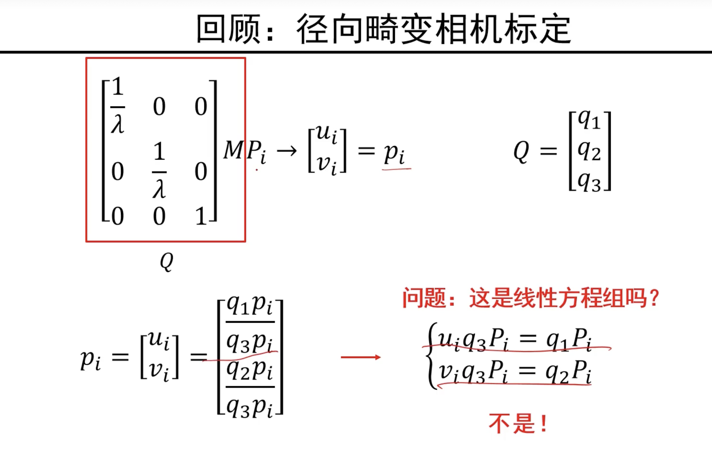
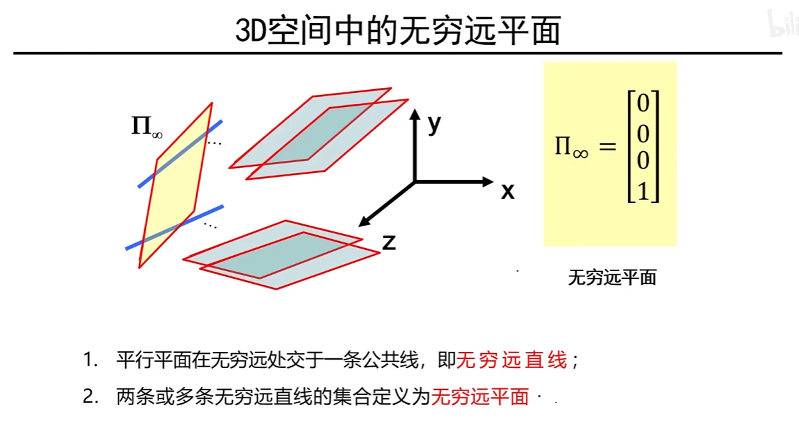

$\rho$ 的解释：在基于最小二乘法求解上述超定线性方程组时，为了防止解的退化，我们人为地限制了 $\vec{m}$ 的二范数等于1，但是这样限制的话，所求得的解必然和真实的解之间相差一个常数，而系数 $\rho$ 正是为了解决这一问题的，其称之为“缩放因子”。

[精准空降](https://www.bilibili.com/video/BV1DP41157dB?t=1905.3&p=3)